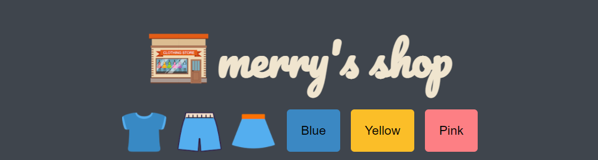
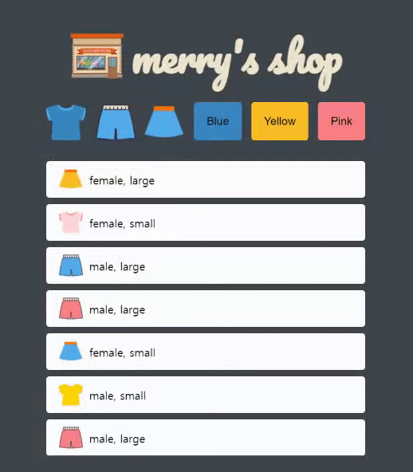
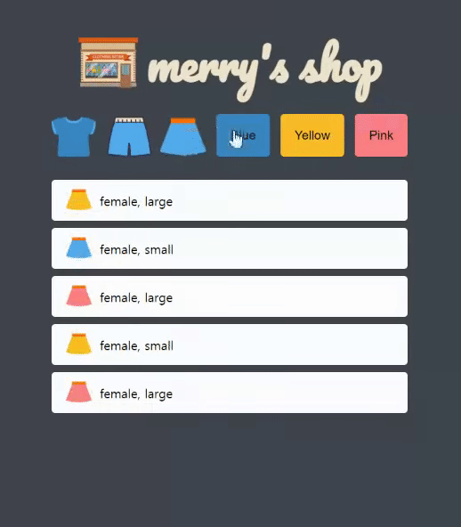

merry.github.io

<h1 align="center"><b>Merry's Shop</b></h1>
<p align="center">


</p>
  
<h2 align="center"><a href="https://noma98.github.io/Item-Filter/"><b>Live Demo</b></a></h2>

---

## **Description**

JSON으로 상품의 정보를 받아와 리스트로 보여주고 버튼 클릭 시 상품의 종류와 색상에 따라 필터링해 보여주는 미니 쇼핑몰입니다.

**이 프로젝트는 드림코딩 아카데미 과정 중 하나로 디자인을 조금 변형한 버전입니다.**

## **How to play**

### Click the clothes button!

 

- 상단의 옷 모양의 버튼을 **클릭**하세요.
- 의상 리스트는 클릭된 버튼에 해당하는 카테고리( tee, pants, skirt )로 필터링되어 보여집니다.

### Click the color button!



- 상단의 색상 버튼을 **클릭**하세요.
- 의상 리스트는 클릭된 버튼에 해당하는 색상( blue, yellow, pink )으로 필터링되어 보여집니다.

# **About the project.**

**Development Environment** : HTML, CSS, Vanilla JS, JSON, vscode, github

### **JSON**

의상 데이터를 하드코딩하지 않고 JSON file에 따로 작성해 fetch api를 통해 데이터를 가져와 리스트로 보여줍니다.

```js
loadItems()
  .then((items) => {
    displayItems(items);
    setEventListeners(items);
  })
  .catch(console.log);

//Fetch the items from the JSON file
function loadItems() {
  return fetch('data/data.json')
    .then((response) => response.json())
    .then((json) => json.items);
}
```

배열함수 map과 join을 활용해 컨테이너 안에 들어갈 의상 목록들을 html문으로 작성한 후 innerHTML로 넣어줍니다.

```js
const container = document.querySelector('.items');
//Update the list with the given items
function displayItems(items) {
  container.innerHTML = items.map((item) => createHTMLString(item)).join('');
}
```

JSON에서 받아온 오브젝트 items의 각 배열 item을 인자로 받아와 안에 들어있는 색상, 카테고리, 이미지 주소 등의 데이터로 해당 의상 목록을 만들기위한 HTML string을 생성합니다.

```js
//Create HTML list item from the given data item
function createHTMLString(item) {
  return `
    <li class="item" data-color="${item.color}" data-type="${item.type}">
        
        <span class="item__description">${item.gender}, ${item.size}</span>
    </li>
    `;
}
```

로고와 버튼 클릭시 이벤트 처리를 위해 json object인 items를 인자로 전달합니다.

```js
function setEventListeners(items) {
  const logo = document.querySelector('.logo');
  const buttons = document.querySelector('.buttons');
  logo.addEventListener('click', () => displayItems(items));
  buttons.addEventListener('click', (event) => onButtonClick(event, items));
}
```

클릭시 발생하는 이벤트 정보와 json 오브젝트를 받아와 데이터셋의 key와 value를 변수로 정의해 널체크 후 updateItems에 각각의 값들을 전달합니다.

```js
//Handle button click
function onButtonClick(event, items) {
  const key = event.target.dataset.key;
  const value = event.target.dataset.value;

  if (key == null || value == null) {
    return;
  }
  updateItems(items, key, value);
}
```

### **Filtering**

생성된 의상 item들을 모아서 배열 items로 만든 후 각각 key와 value의 일치 여부에 따라 class를 토글링해 보여질 아이템들을 필터링합니다.

```js
//Make the items matching {key: value} invisible.
function updateItems(jsonItems, btnKey, btnValue) {
  const items = document.querySelectorAll('.item');
  items.forEach((item) => {
    if (item.dataset[btnKey] === btnValue) {
      item.classList.remove('invisible');
    } else {
      item.classList.add('invisible');
    }
  });
}
```

# **Future scope**

- 가격순, 인기순 등 정렬기준을 더 다양하게 보여주기
- 단순 의상 아이콘이 아니라 실제 쇼핑몰 이미지처럼 표현해보기
